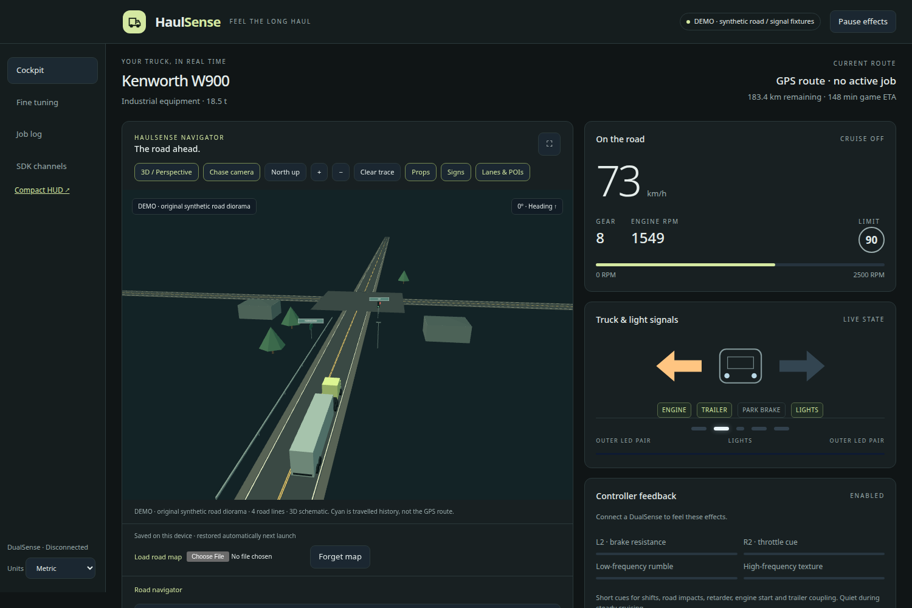
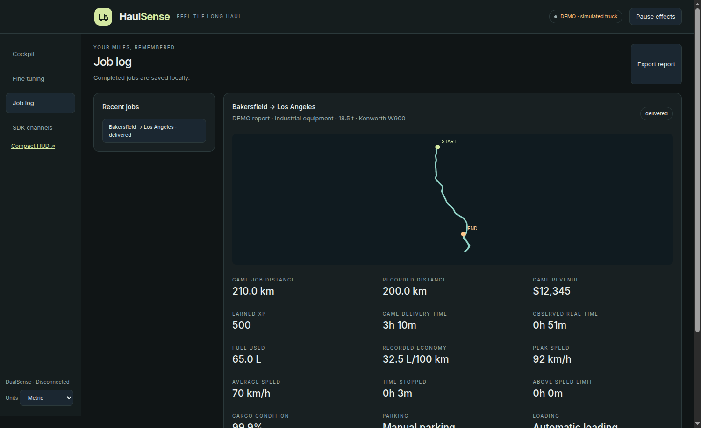

# HaulSense

**Feel the long haul.** A local Linux desktop companion for American Truck Simulator under Proton: a 3D road navigator, job journal and telemetry-driven DualSense feedback.

**1.0.0-rc.1 — release candidate.** Local automated and rendered checks are documented in [qualification](docs/QUALIFICATION.md). Live v7 job/traffic-light operation and a long-haul driving session still need qualification before stable 1.0. USB audio haptics and original game scenery meshes are not implemented.

[Project](https://fglabs.dev/projects/haulsense) · [Releases](https://github.com/FGLabs-dev/HaulSense/releases) · [Issues](https://github.com/FGLabs-dev/HaulSense/issues) · [Security reporting](https://github.com/FGLabs-dev/HaulSense/security/advisories/new)





## The app

- **Standalone cockpit:** an isolated Electron window, native menu, persistent units/window size and updates that continue outside focus. The C++ service keeps the 50 Hz controller path separate from rendering. A browser interface remains available at `http://127.0.0.1:39056`.
- **Local navigator:** Original low-poly WebGL 3D with a smoothed truck chase camera, persistent overview mode, 2D fallback, north-up, zoom, fullscreen and optional scenery layers. Extracted roads include elevation, prefab intersections, sign text, dividers and POIs. Road markings, house roofs, sign boards, divider rails and signal housings use simple geometry; model proxies use measured bounds and imported placements. Truck/trailer shapes are generic, and original game meshes/textures are not included. Maps restore automatically after their first import. The desktop can also load an installed local map automatically.
- **Future route:** an independent directed road/prefab router with city/job destination selection, plus the optional game GPS feed from ETS2LA. The source is always labelled; the independent path can differ from game GPS preferences.
- **Actual semaphore states:** the optional ETS2LA 1.61 provider supplies red/amber/green/off/flashing states, position and remaining time. Missing/stale feeds clear the colours. The nearest signal is not assumed to control your approach. This uses live provider data, not a guessed timer.
- **Job log:** the service records the observed travelled route, distance, real moving/stopped time, speed, fuel, cargo condition, fines, tolls and transport payments. V7 adds the game's delivery revenue, XP, job distance/time and parking/loading flags. Completed/cancelled jobs are retained locally with JSON export; active recording survives a clean service restart. Coverage gaps and partial observations are explicit.
- **Cockpit and compact HUD:** speed, gear, RPM, cruise, navigation/ETA, fuel, brake air, temperatures, inputs, wheel contact and wear. Metric/US units, measured warnings and missing-channel fallbacks. The optional GTK HUD remains available.
- **DualSense immersion:** adaptive L2 braking, restrained R2/road texture and short event cues. Mirrored standard generations 4/5 show individual turns in the HUD/cockpit; white LEDs handle lights/hazards. Independent revisions retain directional masks. Unknown revisions/Edge and broader USB/Bluetooth firmware coverage remain qualification work.
- **Local by design:** no accounts, cloud reporting, advertising, analytics or remote UI scripts/fonts. The standalone renderer has no Node access. Maps, preferences and job reports remain on your device.

## Install a prepared bundle

Extract the candidate archive and run `./standalone/haulsense-app`, or use `./ats-dualsense/scripts/install-desktop.sh` to install its launcher. The prepared desktop needs no Node installation. Run `install-all.sh` for the service/game plugin setup; it preserves existing settings. Restart ATS afterwards.

## Install from source

Linux x86-64, GCC 11+/Clang with C++20, CMake 3.20+, Node.js 24/npm for desktop packaging, Clang/LLD for the freestanding Windows DLL. The desktop bundle contains Electron; users of a prepared bundle need no Node installation. USB/Bluetooth output uses the kernel `hid-playstation` driver; udev setup can require sudo.

```bash
./ats-dualsense/scripts/install-all.sh
./ats-dualsense/scripts/install-desktop.sh
haulsense-app
```

Set `ATS_DIR='/path/to/American Truck Simulator'` for a custom Steam library. Use `SKIP_UDEV=1` if permissions already exist. Installers preserve customized config and existing HUD settings. Restart ATS after replacing game plugins; an already running DLL keeps its old protocol until then.

The app reuses `haulsense.service` when present, otherwise starts its bundled native daemon. Closing the app leaves an existing user service running; a daemon started by the app is stopped cleanly. `haulsense-app --demo` uses isolated hardware-free demo ports and never writes to the controller.

### Maps and live signal/GPS provider

The standalone selects an embedded, compressed map automatically. There is no map file picker and old IndexedDB imports are ignored. Local packaging (`npm run --prefix ats-dualsense/desktop package -- --local-maps`, also used by the source desktop installer) embeds `build/ats-scene.json` / `build/ets2-scene.json` with extracted `gameVersion` metadata. Steam libraries are discovered automatically. The installed version archive and game/DLC archive inventory must match the pack; game/content updates disable incompatible roads instead of silently using stale data. The verified local ATS pack is **1.61.3.1**, approximately **24 MiB compressed**. ETS2 has no locally qualified embedded pack yet.

The standalone also bundles the checksum-pinned MIT **1.61.x** ETS2LA provider and installs it automatically into a verified matching Windows game installation, backing up a different existing DLL. Its status distinguishes installation from a live connection. Restart the game after a new provider installation. Game-derived packs stay in the local application; the public source/archive excludes them. Automatic extraction for arbitrary fresh installations and future game versions is not implemented; those builds need matching map packs prepared during packaging. See [pack creation and compatibility](docs/WEB-NAVIGATOR.md).

Under Wine/Proton, the provider creates `/dev/shm/ETS2LASemaphore` and `/dev/shm/ETS2LARoute`. HaulSense reads them without writing controls or injecting into game memory. Do not use this pinned provider for another game version. [Provider ABI, compatibility and freshness](docs/SIGNAL-PROVIDER.md) explains the limitations and live qualification gap.

### Compact HUD

Use **Compact HUD** in the app, `http://127.0.0.1:39056/hud`, or the optional **HaulSense HUD** desktop launcher. GTK needs Python 3, PyGObject and GTK 3. Drag the window; right-click for monitor, units, opacity and size. Existing preferences remain in `~/.config/haulsense/hud.json`. A free-driving GPS route without job city metadata is labelled “Percorso GPS”.

## Build and verify

```bash
cmake -S . -B build -DCMAKE_BUILD_TYPE=Release
cmake --build build -j2
ctest --test-dir build --output-on-failure
python3 tests/integration.py build
python3 tests/map_export.py
node tests/routing.cjs
./ats-dualsense/plugin-win/build-windows-dll.sh
npm ci --prefix ats-dualsense/desktop --ignore-scripts
node ats-dualsense/desktop/node_modules/electron/install.js
npm test --prefix ats-dualsense/desktop
npm run --prefix ats-dualsense/desktop package
python3 scripts/check-release.py
```

DOM/browser qualification commands and fixture limitations are in [qualification](docs/QUALIFICATION.md). CI builds native/Windows/standalone artifacts, exercises migration/HTTP/recording/provider regressions and audits dependencies. CodeQL and dependency review run separately; local green checks do not imply remote CI approval.

## Data and security

Configuration: `~/.config/ats-dualsense/config.conf`. Desktop preferences/map cache: `${XDG_CONFIG_HOME:-~/.config}/haulsense/`. Native job journal: `${XDG_DATA_HOME:-~/.local/share}/haulsense/jobs/` (private permissions, 50 reports maximum, up to 10,000 route samples per report with downsampling). Browser caches live in that browser's profile. Reports record your driving history; exported JSON is an explicit user action.

The API binds to loopback, rejects foreign Hosts/origins and ambiguous security headers, and serves a strict script CSP. The desktop uses a private local protocol, renderer sandbox/context isolation, no Node integration, denied permissions and restricted navigation/downloads. Packages disable unnecessary Electron fuses. See [security policy](SECURITY.md), [architecture](docs/ARCHITECTURE.md) and [release process](docs/RELEASING.md).

HaulSense is MIT licensed. SCS SDK, Three.js, nlohmann/json and Electron notices are retained. ATS/ETS2 trademarks and game data belong to their owners; this is an independent companion, not an official SCS product. No proprietary map archives, meshes or textures are included.
