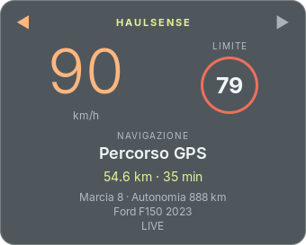

# HaulSense

**Feel the long haul.** A small native Linux companion for American Truck Simulator under Proton, with a live truck dashboard and telemetry-driven DualSense effects.

[Project page](https://fglabs.dev/projects/haulsense) · [Releases](https://github.com/FGLabs-dev/HaulSense/releases) · [Report a bug](https://github.com/FGLabs-dev/HaulSense/issues)

> Public alpha: automatic tests cover the SDK adapter, wire protocol, effect engine, local API and UI DOM. Full in-game driving qualification and visual browser review of this new dashboard are still pending. Feedback uses compatible rumble and adaptive triggers; USB audio haptics are not implemented.

## What it does

- **A cockpit that earns its space:** speed, displayed gear, RPM, cruise, route/ETA, fuel consumption/range, brake air, coolant/oil, battery, inputs, wheel contact and component condition. Metric and US units.
- **Revision-aware white LEDs:** independent revisions retain left/right sweeps. Standard DualSense generations 4 and 5 have mirrored player LED pairs; their turn signals appear in the HUD only, while white LEDs remain available for truck lights and hazards. Unrecognized revisions and DualSense Edge still require physical qualification.
- **Adaptive L2 brakes**, a subtle R2 full-throttle cue and restrained heavy-brake texture. Setting trigger strength to zero disables all resistance, including low-air cues.
- **Event-driven immersion:** gear shifts, road impacts, engine starts, retarder, engine brake, parking brake, trailer coupling, lift axle and SDK gameplay events. Delivery/fine acknowledgements have distinct colours. Optional gentle reverse and wiper rhythms.
- **Calm lightbar:** blue driving/lights, white reverse, amber hazards, breathing gold beacon. Engine warnings are gated by engine state; critical wear starts at 85%.
- **Fine tuning:** Calm, Balanced and Immersive presets, eight sliders, optional cues, master pause and persistent settings. No continuous RPM/throttle vibration.
- **SDK inspector:** subscribed values and missing-channel status, without pretending unavailable values are zero. Primary-trailer telemetry is included; extended trailer trains and spatial placement are not exposed yet.
- **Local and lightweight:** C++20 daemon, no runtime Node/Electron in the daemon, no cloud, no third-party scripts/fonts, no account. Dashboard is embedded in the binary, opens in your browser, and stops fetching when hidden. Its 24-second history is bounded and never recorded to disk.

```text
ATS.exe → SCS SDK 1.14 DLL → localhost UDP :39055 → HaulSense → DualSense atomic HID output
                                                   └→ localhost HTTP :39056 → browser cockpit
```

## Install

Restart ATS after installation to load the updated plugin. Linux x86-64, DualSense/DualSense Edge and the kernel `hid-playstation` driver are required. USB and Bluetooth are supported by the report encoder; broad firmware/transport qualification remains an alpha gate.

Source prerequisites: GCC 11+ or Clang with C++20 support, CMake 3.20+, and Clang + LLD for the Windows plugin. The plugin is freestanding: no Windows SDK or MinGW is needed. Release bundles include the DLL and an optional Linux executable, so Clang/LLD are not needed to install a bundle.

```bash
./ats-dualsense/scripts/install-all.sh
```

Game discovery checks common Steam library locations. Override it with:

```bash
ATS_DIR='/path/to/American Truck Simulator' ./ats-dualsense/scripts/install-all.sh
```

The installer installs the DLL, user service, app launcher and udev permissions. It preserves customized config and backs it up before migration. Udev installation is the only step requiring sudo. If suitable permissions already exist, use `SKIP_UDEV=1`.

Open **HaulSense** from the application menu, or visit **http://127.0.0.1:39056**. `haulsense.service` runs independently of the dashboard. The old `ats-dualsense` executable becomes a compatibility alias; the old service is disabled to avoid two bridges fighting over the controller.

### Compact HUD

Open **HaulSense HUD** from the application menu for a separate transparent window, or use **Compact HUD** in the dashboard for a small browser page at **http://127.0.0.1:39056/hud**. Both reuse the existing local telemetry service and clear values when ATS is paused or disconnected. The HUD shows speed, navigation speed limit, destination, remaining distance/time and left/right signals. The SDK provides a job destination city. Manually selected GPS routes expose distance/time without a city name; the HUD labels them “Percorso GPS”.

The desktop HUD is optional and requires Python 3, PyGObject and GTK 3 (on Ubuntu/Zorin: `python3-gi` and `gir1.2-gtk-3.0`); it does not add a framework to the native service. Drag it to position it. Right-click to choose a monitor, corner, metric/US units, opacity or size; settings are saved under `~/.config/haulsense/hud.json`. You can also run `haulsense-hud --list-monitors` and `haulsense-hud --monitor 1` from a terminal. On this GNOME Wayland desktop it runs through Xwayland so the window manager can keep it above ordinary windows. Exclusive fullscreen games can still cover it; move it to the other monitor or use borderless/windowed mode in that case. The browser page is useful on another monitor, but browser window transparency and always-on-top are browser-dependent.

## Build / test

```bash
cmake -S . -B build -DCMAKE_BUILD_TYPE=Release
cmake --build build -j2
ctest --test-dir build --output-on-failure
python3 tests/integration.py build
./ats-dualsense/plugin-win/build-windows-dll.sh
```

Optional DOM smoke test (test dependency only):

```bash
npm install --prefix .test-deps linkedom --no-audit --no-fund
NODE_PATH="$PWD/.test-deps/node_modules" node tests/ui.mjs build/ui-state.json
NODE_PATH="$PWD/.test-deps/node_modules" node tests/hud.mjs
```

**Hardware-free preview:** stop the installed service, run `./build/ats-dualsense/daemon/haulsense --mock --config /tmp/haulsense-demo.conf`, and open the dashboard. Demo state is clearly labelled and never opens the controller. `--mock-hardware` explicitly opts into controller output.

## Control and diagnostics

```bash
haulsense --diagnostics
haulsense --telemetry-debug
journalctl --user -u haulsense.service -f
systemctl --user stop haulsense.service
haulsense --led-test
systemctl --user start haulsense.service
```

Stop the service before launching another daemon instance or an LED test. LED discovery is associated with the selected HID device, including when several controllers are connected. Live player LED control sends the complete five-bit mask in one HID report with the instant-update flag. Video review of the attached generation-5 controller confirms mirrored inner and outer pairs. Its read-only hardware report is `0x00000514`. Generation 4 mirroring is also documented by other controller implementations; see the qualification record. Sysfs discovery is diagnostic only; legacy `sysfs_player_leds` settings are ignored. The diagnostic requests each LED bit separately; mirrored hardware physically lights the corresponding pair.

If you use Steam Input to drive, leave it enabled for ATS. In Steam's **Settings → Controller → your DualSense → Calibration & Advanced Settings → LED Settings**, set **Player Slot LED** to **Off** to disable Steam’s own player assignment. This setting was already off during the physical tests; it cannot separate hardware-mirrored pairs. This is a controller-wide Steam preference. HaulSense detects known mirrored revisions and uses HUD-only turn signals on them.

Settings remain in `~/.config/ats-dualsense/config.conf` for migration compatibility, or `$XDG_CONFIG_HOME/ats-dualsense/config.conf` when set. `--config PATH` overrides the location. The dashboard saves only known settings and preserves other user keys.

Pause events immediately send a neutral state. Missing/invalid telemetry times out after 500 ms. Legacy-plugin pauses use this timeout; the new plugin sends pause immediately. Frames must match an exact supported packet version and size; the legacy v4/175-byte adapter keeps an already running game compatible during migration, with inferred availability clearly labelled. New v5 frames carry explicit channel availability; bad frames are counted, not applied. The socket is drained to the newest valid frame, with bounded per-loop work. Controller output is capped at 50 Hz; changed LEDs/HID output are sent only when necessary.

[Architecture and security boundaries](docs/ARCHITECTURE.md) · [SDK coverage](docs/TELEMETRY.md) · [Qualification](docs/QUALIFICATION.md) · [Roadmap](docs/ROADMAP.md)

## Remove

```bash
./ats-dualsense/scripts/uninstall.sh
```

Keeps user settings and the udev rule. Third-party SDK notices are in `ats-dualsense/third_party/scs-sdk/LICENSE`. HaulSense is an independent FG Labs project, unaffiliated with Sony or SCS Software.

### HUD improvements

The native HUD and `/hud` now center their labels, speed, limit and route data. GPS distance/ETA remain visible without a job; the name of a city is only available for a job destination. The HUD also displays gear, fuel range, cruise target and contextual warnings, with metric/US conversion and stale-data clearing. Native HTTP requests run in a background thread so dragging and menus stay responsive. Existing HUD position, monitor, units, opacity and scale preferences are preserved.

On independent revisions, directional player LED masks sweep from inner to outer on the selected side, with the center off during signals; hazards sweep both sides. On known mirrored revisions, individual turns use HUD arrows and leave the center truck-light indicator available. Player LED commands are sent only on mask changes, independently of rumble, triggers and RGB updates. Known mirrored revisions cannot show independent physical directions; unknown revisions still need visual qualification. See [SDK capabilities and further options](docs/SDK-CAPABILITIES.md).

HUD regression: `NODE_PATH=/path/to/linkedom/node_modules node tests/hud.mjs`. Screenshots used for local visual review are in `build/hud-review/` (generated, not release assets).



Local GTK rendering with a telemetry fixture, not an in-game capture. The web HUD demo is [shown here](docs/media/hud-web-demo.png). Neither image qualifies physical controller behavior.
